# 📸 Project Screenshots

Portfolio screenshots for the Brothers Phone - Stock Management E-Commerce Platform

---

## 🏠 Public Website

### 1. Homepage (`01-homepage.png`)
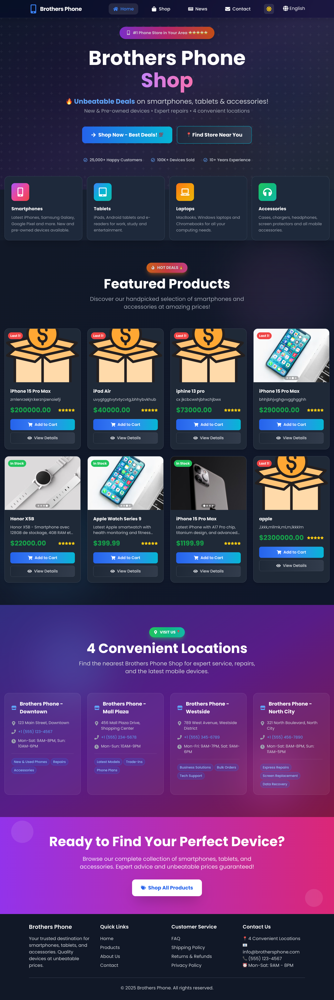

**Features Shown:**
- Modern landing page with dark theme
- Featured products section with 8 products
- Category cards (Smartphones, Tablets, Laptops, Accessories)
- Four convenient store locations section
- Professional navigation and footer
- Responsive design

**Tech Highlights:**
- React with Tailwind CSS
- Framer Motion animations
- Multi-language support (EN, FR, AR)
- Dark/Light mode toggle

---

### 2. Products Page (`02-products-page.png`)
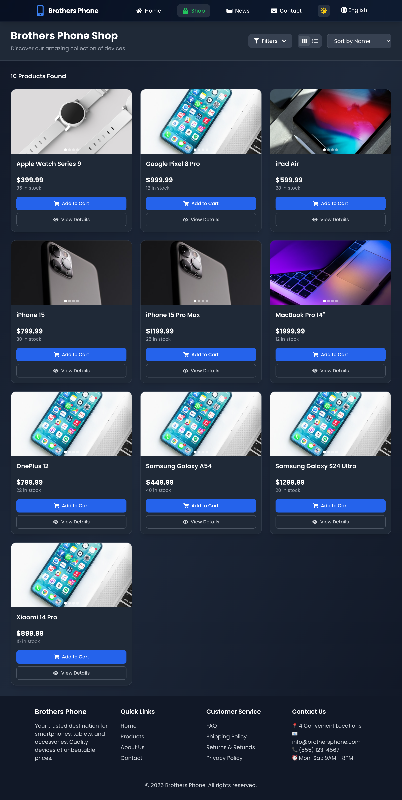

**Features Shown:**
- Grid layout with 10 products
- Product cards with:
  - Image carousel (4 images per product)
  - Price and stock information
  - Add to Cart and View Details buttons
- Filter and sort functionality
- View toggle (grid/list)
- Search capability

**Products Displayed:**
- Apple Watch Series 9 - $399.99
- Google Pixel 8 Pro - $999.99
- iPad Air - $599.99
- iPhone 15 - $799.99
- iPhone 15 Pro Max - $1,199.99
- MacBook Pro 14" - $1,999.99
- OnePlus 12 - $799.99
- Samsung Galaxy A54 - $449.99
- Samsung Galaxy S24 Ultra - $1,299.99
- Xiaomi 14 Pro - $899.99

---

## 🔐 Authentication

### 3. Admin Login (`03-admin-login.png`)
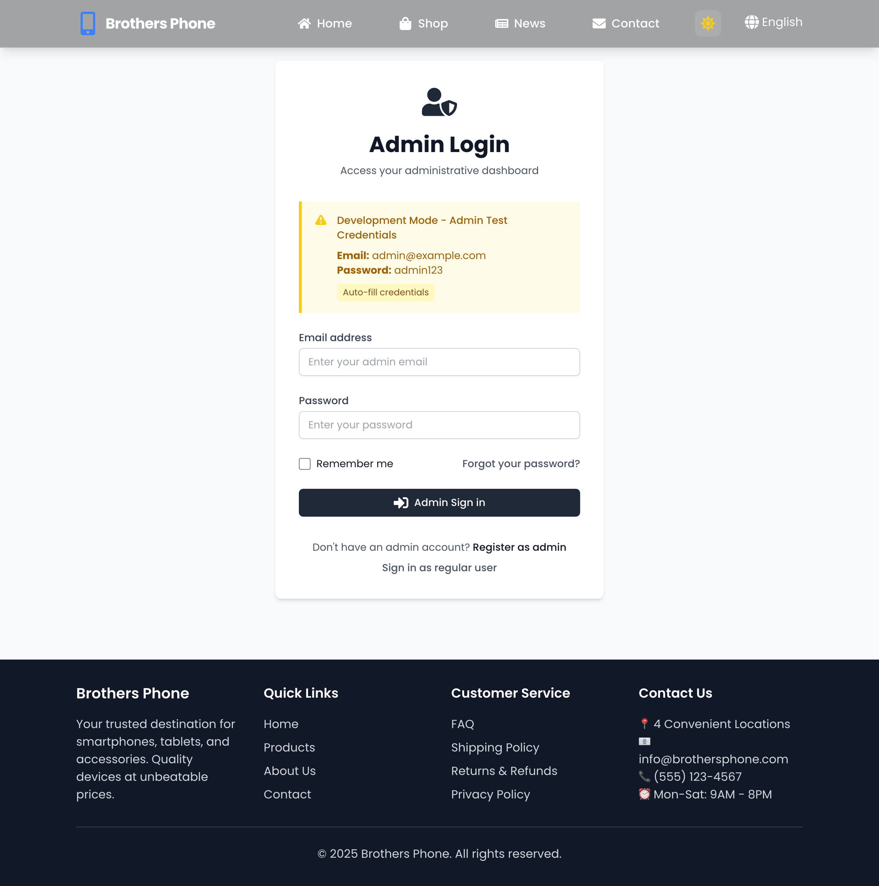

**Features Shown:**
- Clean, professional login form
- Email and password fields
- Remember me checkbox
- Forgot password link
- Development mode test credentials display
- Auto-fill credentials button
- Link to regular user login
- Link to admin registration

**Demo Credentials:**
- Email: admin@demo.com
- Password: admin123

---

## 👨‍💼 Admin Panel

### 4. Admin Dashboard (`04-admin-dashboard.png`)
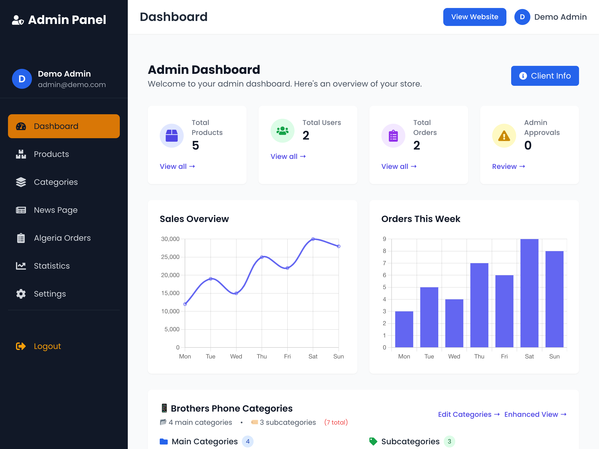

**Features Shown:**
- **Statistics Cards:**
  - Total Products: 5
  - Total Users: 2
  - Total Orders: 2
  - Admin Approvals: 0

- **Charts:**
  - Sales Overview (line chart)
  - Orders This Week (bar chart)
  - Sales by Category (doughnut chart)

- **Categories Overview:**
  - 4 main categories
  - 3 subcategories
  - Smartphones (Apple, Samsung, Xiaomi)
  - Occasions, Laptops, Accessories

- **Low Stock Products Table:**
  - iPhone 13 (3 units)

- **Recent Orders Table:**
  - Order #2 - Demo User - $32,000.00 (Pending)
  - Order #1 - Demo User - $85,000.00 (Completed)

- **Quick Actions:**
  - Smart Wizard
  - Add Product
  - Manage Categories
  - View Reports

---

### 5. Admin Products Management (`05-admin-products.png`)
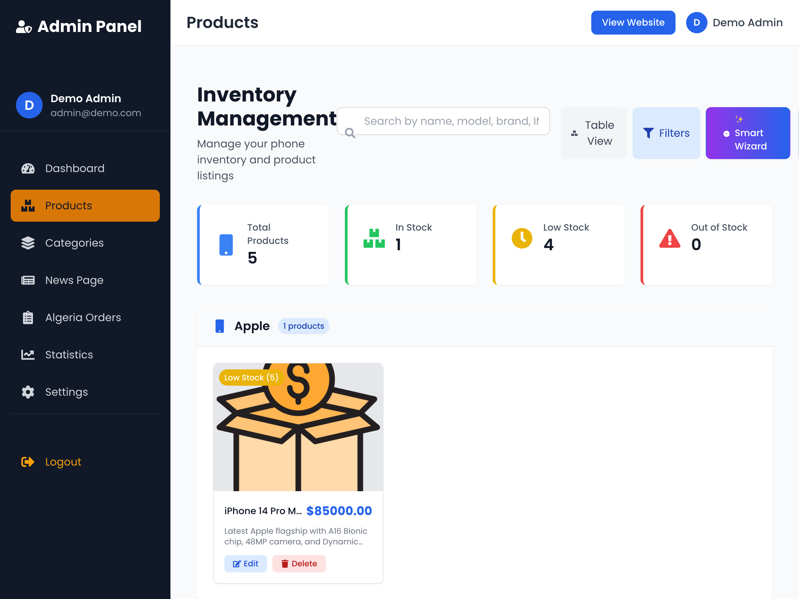

**Features Shown:**
- **Inventory Overview:**
  - Total Products: 5
  - In Stock: 1
  - Low Stock: 4
  - Out of Stock: 0

- **Search & Filters:**
  - Search by name, model, brand, IMEI, SN
  - Table/Grid view toggle
  - Filters button
  - Smart Wizard link
  - Manual Add link

- **Products by Category:**
  
  **Apple (1 product):**
  - iPhone 14 Pro Max - $85,000.00 (Low Stock: 5 units)
    - Latest Apple flagship with A16 Bionic chip, 48MP camera

  **Samsung (2 products):**
  - Samsung Galaxy S23 Ultra - $75,000.00 (Low Stock: 8 units)
    - Premium flagship with S Pen, 200MP camera
  - Samsung Galaxy A54 - $32,000.00 (In Stock: 15 units)
    - Mid-range with great camera and 5G

  **Occasions (1 product):**
  - iPhone 13 - $45,000.00 (Low Stock: 3 units)
    - Used iPhone 13, excellent condition, 87% battery health

  **Xiaomi (1 product):**
  - Xiaomi 13 Pro - $55,000.00 (Low Stock: 10 units)
    - Flagship with Leica camera system

- **Product Actions:**
  - Edit button for each product
  - Delete button for each product

---

## 🧙‍♂️ Smart Product Wizard

### 6. Smart Wizard - Step 1: Choose Category (`06-smart-wizard-step1.png`)

**Features Shown:**
- **Multi-step progress indicator** (4 steps)
- **Step 1: Choose Product Category**
- Beautiful category cards with icons:
  - Accessoires 🔌
  - Affaire du jour 💰
  - Brother's Packs 📦
  - Laptop 💻
  - Livraison Gratuite 🚚
  - Occasions ❤️
  - Smartphones 📱
  - Smartwatches ⌚
  - Tablets 📱

**UX Features:**
- Clean, intuitive interface
- Icon-based selection
- Clear visual hierarchy
- Professional wizard design

---

### 7. Smart Wizard - Step 2: Choose Brand (`07-smart-wizard-step2.png`)
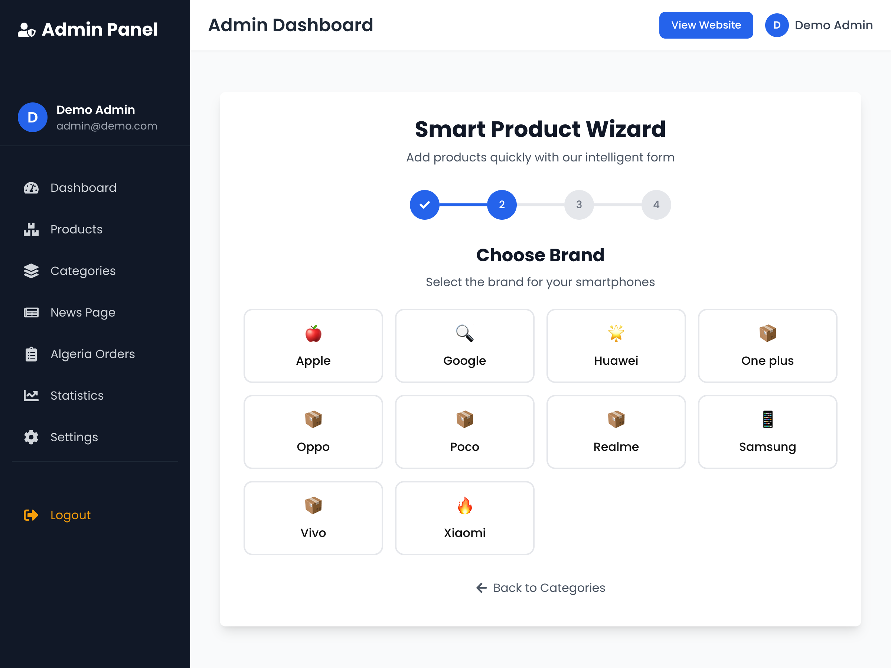

**Features Shown:**
- **Step 2: Brand Selection** (after selecting Smartphones)
- Progress indicator shows completion of step 1
- Brand cards with emojis:
  - 🍎 Apple
  - 🔍 Google
  - 🌟 Huawei
  - 📦 One plus
  - 📦 Oppo
  - 📦 Poco
  - 📦 Realme
  - 📱 Samsung
  - 📦 Vivo
  - 🔥 Xiaomi

**Navigation:**
- Back to Categories button
- Context-aware navigation
- Consistent design pattern

---

### 8. Smart Wizard - Step 3: Product Details (`08-smart-wizard-step3.png`)
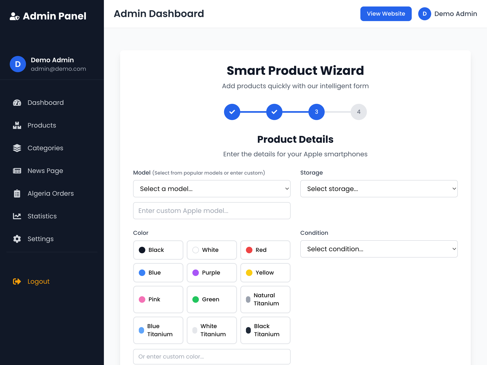

**Features Shown:**
- **Step 3: Detailed Product Form** (for Apple Smartphones)
- Intelligent form fields:

  **Model Selection:**
  - Dropdown with 18+ popular iPhone models
  - Custom model input option
  - Models from iPhone 15 Pro Max to iPhone SE

  **Storage Options:**
  - 64GB, 128GB, 256GB, 512GB, 1TB
  - Dropdown selection

  **Color Selection:**
  - Visual color picker with radio buttons
  - 12 color options:
    - Standard: Black, White, Red, Blue, Purple, Yellow, Pink, Green
    - Premium: Natural Titanium, Blue Titanium, White Titanium, Black Titanium
  - Custom color input field

  **Condition:**
  - 🆕 New
  - 👍 Used
  - 🔄 Refurbished

  **IMEI Number:**
  - Input field with validation
  - 🎲 Generate button for testing
  - Unique constraint notification

  **Battery Health:**
  - Slider control (1-100%)
  - Visual indicators (Poor/Good/Excellent)
  - Number input for precise entry
  - Helpful tip for Apple devices

**Smart Features:**
- Context-aware fields (Apple-specific)
- Form validation
- Helper text and tooltips
- Auto-generation for testing
- Back and Continue navigation

---

## 📱 Mobile & Responsive Design

### 11. Mobile Navigation (`11-mobile-nav.png`)
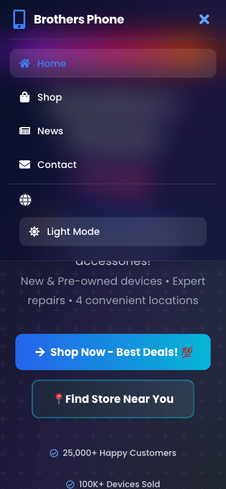

**Features Shown:**
- **Mobile hamburger menu** with slide-out navigation
- **Navigation links:** Home, Shop, News, Contact
- **Language selector** (English, Français, العربية)
- **Theme toggle** (Light/Dark mode)
- **Clean mobile UI** with proper spacing
- **Overlay design** showing main content behind

**UX Features:**
- Intuitive hamburger menu
- Easy access to all sections
- Theme switching capability
- Multi-language support

---

### 12. Mobile Hero Section (`12-mobile-hero.png`)
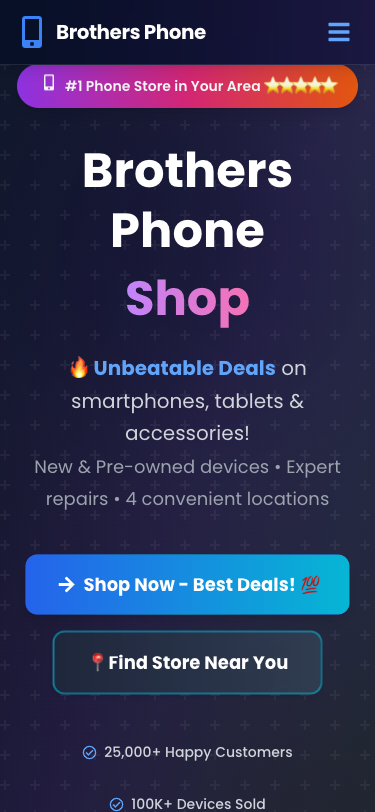

**Features Shown:**
- **Mobile-optimized hero** with proper text sizing
- **Call-to-action buttons** sized for touch
- **Customer statistics** with icons
- **Responsive layout** adapting to mobile screen
- **Touch-friendly interface**

**Mobile UX:**
- Large, tappable buttons
- Readable text sizes
- Proper spacing for thumbs
- Clear visual hierarchy

---

### 13. Mobile Product Categories (`13-mobile-products.png`)
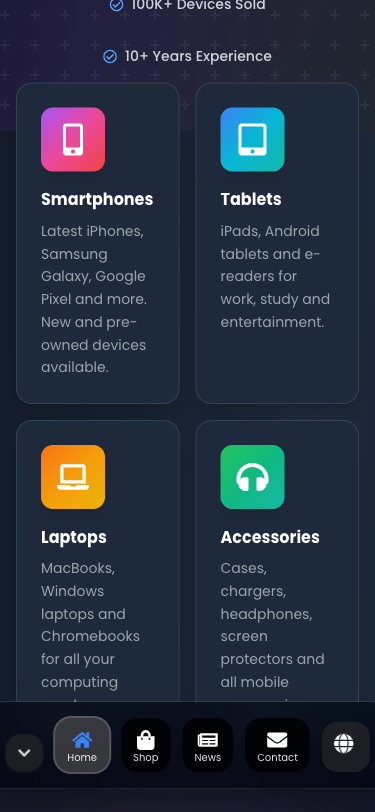

**Features Shown:**
- **2x2 grid layout** optimized for mobile
- **Category cards** with icons and descriptions
- **Bottom navigation bar** with active states
- **Touch-optimized** card sizes
- **Clean mobile typography**

**Responsive Design:**
- Grid adapts to screen size
- Cards sized for easy tapping
- Consistent spacing
- Mobile-first approach

---

## 🌞 Light Mode Screenshots

### 14. Mobile Light Mode (`14-mobile-light-mode.png`)
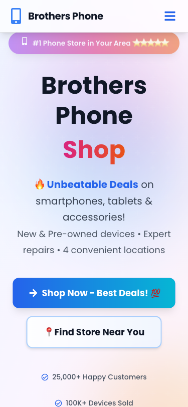

**Features Shown:**
- **Light theme** with white/light backgrounds
- **Dark text** on light backgrounds
- **Consistent branding** across themes
- **Mobile-optimized** light mode
- **Accessibility** with proper contrast

**Theme Features:**
- Easy theme switching
- Consistent design language
- Proper contrast ratios
- User preference persistence

---

### 15. Desktop Light Mode (`15-desktop-light-mode.png`)
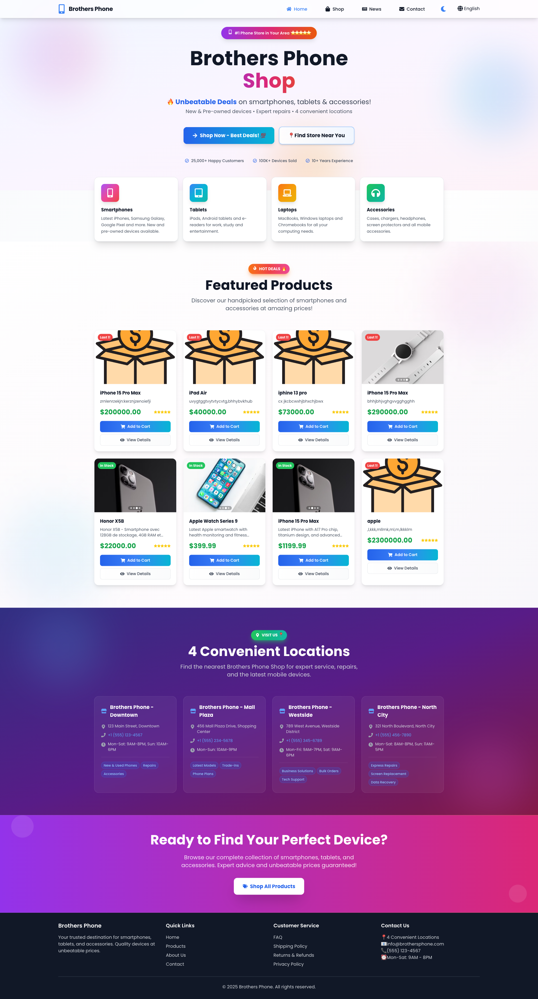

**Features Shown:**
- **Full desktop light mode** experience
- **Light backgrounds** with dark text
- **Professional appearance** for business use
- **All features** available in light theme
- **Consistent branding** across themes

**Light Mode Benefits:**
- Better for daytime use
- Reduced eye strain
- Professional appearance
- Accessibility compliance

---

## 🛠️ Technical Implementation

### Frontend
- **Framework:** React 18
- **Styling:** Tailwind CSS
- **Animations:** Framer Motion
- **Routing:** React Router v6
- **State Management:** Context API
- **Form Handling:** Formik + Yup
- **Charts:** Chart.js + react-chartjs-2
- **Notifications:** React Toastify

### Backend
- **Runtime:** Node.js
- **Framework:** Express.js
- **Database:** PostgreSQL (with Sequelize ORM)
- **Demo Mode:** localStorage (for portfolio)
- **Authentication:** JWT
- **File Upload:** express-fileupload
- **Image Storage:** Cloudinary

### Features
- ✅ **Demo Mode:** Fully functional without backend
- ✅ **Dual Mode:** Easy switch between demo/production
- ✅ **Multi-language:** English, French, Arabic
- ✅ **Dark/Light Theme:** User preference saved
- ✅ **Responsive Design:** Mobile, tablet, desktop
- ✅ **Product Management:** CRUD operations
- ✅ **Category Management:** Nested categories
- ✅ **Order Management:** Full order lifecycle
- ✅ **Dashboard Analytics:** Real-time statistics
- ✅ **Role-Based Access:** Admin/User permissions
- ✅ **Search & Filter:** Advanced product search
- ✅ **Stock Management:** Low stock alerts

---

## 📊 Demo Data

The screenshots show a fully functional demo with:
- **5 Products** across 4 categories
- **2 Users** (1 admin, 1 regular user)
- **2 Orders** (1 completed, 1 pending)
- **7 Categories** (4 main + 3 subcategories)
- **Real-time charts** with sample data
- **Stock tracking** with low stock alerts

---

## 🎨 Design Features

- Modern, professional UI
- Clean, intuitive navigation
- Consistent color scheme
- Icon usage throughout
- Responsive grid layouts
- Smooth animations and transitions
- Accessibility considerations
- Mobile-first approach

---

## 🚀 Deployment

These screenshots are from the **demo mode** deployment which:
- Runs entirely in the browser
- Uses localStorage for data
- Requires no backend server
- Perfect for portfolio demonstrations
- Can be deployed to Vercel/Netlify for free

---

## 📝 Use Cases

Perfect for showcasing:
- ✨ Full-stack development skills
- 🎨 Modern UI/UX design
- 📊 Data visualization and dashboards
- 🔐 Authentication and authorization
- 📱 Responsive web design
- ⚙️ State management
- 🛠️ CRUD operations
- 📈 E-commerce functionality

---

**Created:** October 2025  
**Mode:** Demo Mode (localStorage)  
**Status:** ✅ Fully Functional

---

All screenshots are ready to be used in your portfolio, resume, or project documentation!

